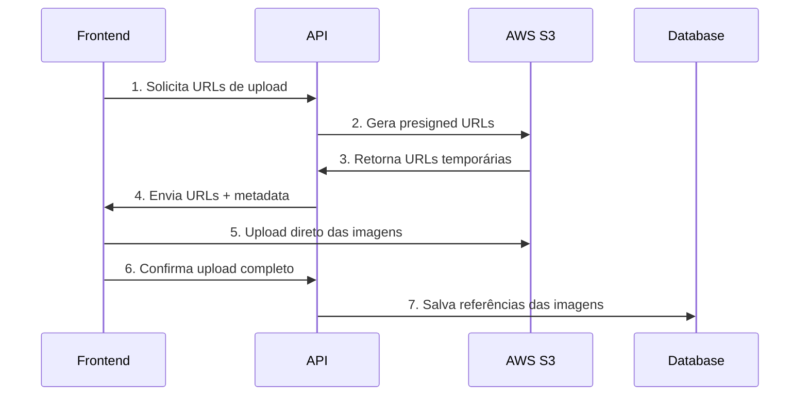

# No de Duas API

Uma API R## ??? Tecnologias Utilizadas

- **NestJS** - Framework Node.js
- **TypeScript** - Linguagem de programação
- **Prisma** - ORM para banco de dados
- **JWT** - Autenticação com tokens
- **bcrypt** - Hash de senhas
- **Custom Exceptions** - Tratamento de erros personalizado
- **LocalStack** - Simulação local de serviços AWS S3 para desenvolvimentoonstruída com **NestJS**, **TypeScript** e **Prisma**, implementando autenticação JWT, sistema de roles/permissões e tratamento de exceções personalizado.

## ?? Quick Start para Desenvolvedores

**Novo no projeto?** Siga o guia rápido:

```bash
# 1. Clone o repositório
git clone <repository-url>
cd no-de-duas-api

# 2. Execute o setup automatizado
./scripts/dev-setup.sh

# 3. Acesse a API
curl http://localhost:3000/health

# 4. Teste a integração S3 (opcional)
./scripts/test-s3.sh
```

**Pronto!** Sua API está rodando em http://localhost:3000
- LocalStack S3: http://localhost:4566 (para desenvolvimento)

?? **Para instruções detalhadas de desenvolvimento, veja [DEVELOPMENT.md](./DEVELOPMENT.md)**
?? **Para histórico de mudanças, veja [CHANGELOG.md](./CHANGELOG.md)**

> **Nota**: Se você encontrar problemas relacionados ao Prisma, eles foram corrigidos na versão atual. Use `./scripts/test-prisma.sh` para diagnóstico.

## ?? Tecnologias Utilizadas

- **NestJS** - Framework Node.js
- **TypeScript** - Linguagem de programação
- **Prisma** - ORM para banco de dados
- **JWT** - Autenticação com tokens
- **bcrypt** - Hash de senhas
- **Custom Exceptions** - Tratamento de erros personalizado

## ?? Estrutura do Projeto

```
src/
??? auth/                    # Módulo de autenticação
??? users/                   # Módulo de usuários
??? common/
?   ??? exceptions/          # Exceções customizadas
?   ??? filters/             # Filtros globais
??? prisma/                  # Configuração do Prisma
??? main.ts                  # Ponto de entrada
```

## ?? Sistema de Autenticação

### Fluxo de Autenticação

1. **Login** ? Recebe `access_token` e `refresh_token`
2. **Uso do Access Token** ? Acesso a rotas protegidas
3. **Renovação** ? Usa `refresh_token` para obter novos tokens
4. **Logout** ? Revoga tokens de refresh

### Tokens JWT

- **Access Token**: Expira em 15 minutos
- **Refresh Token**: Expira em 7 dias
- **Armazenamento**: Refresh tokens são salvos no banco de dados

## ?? Documentação das Rotas

### ?? Autenticação

#### `POST /auth/login`

Realiza login do usuário.

**Request Body:**

```json
{
  "email": "user@example.com",
  "password": "password123"
}
```

**Response:**

```json
{
  "access_token": "eyJhbGciOiJIUzI1...",
  "refresh_token": "eyJhbGciOiJIUzI1...",
  "user": {
    "id": "uuid",
    "email": "user@example.com",
    "name": "User Name",
    "roles": ["user"]
  }
}
```

**Exceções:**

- `InvalidCredentialsException` (401) - Email ou senha incorretos

---

#### `POST /auth/refresh`

Renova tokens de acesso.

**Request Body:**

```json
{
  "refresh_token": "eyJhbGciOiJIUzI1..."
}
```

**Response:**

```json
{
  "access_token": "eyJhbGciOiJIUzI1...",
  "refresh_token": "eyJhbGciOiJIUzI1..."
}
```

**Exceções:**

- `TokenExpiredException` (401) - Token expirado
- `UnauthorizedAccessException` (403) - Token inválido

---

#### `GET /auth/profile`

Obtém dados do usuário logado.

**Headers:**

```
Authorization: Bearer {access_token}
```

**Response:**

```json
{
  "id": "uuid",
  "email": "user@example.com",
  "name": "User Name",
  "roles": ["user"]
}
```

---

#### `POST /auth/logout`

Realiza logout revogando tokens.

**Headers:**

```
Authorization: Bearer {access_token}
```

**Request Body:**

```json
{
  "refresh_token": "eyJhbGciOiJIUzI1..."
}
```

### ?? Gerenciamento de Usuários

#### `POST /users`

Cria um novo usuário.

**Headers:**

```
Authorization: Bearer {access_token}
```

**Request Body:**

```json
{
  "name": "João Silva",
  "email": "joao@example.com",
  "password": "password123",
  "roles": ["user", "moderator"]
}
```

**Exceções:**

- `UserAlreadyExistsException` (409) - Email já cadastrado
- `InvalidUserDataException` (400) - Dados inválidos ou roles inexistentes

---

#### `GET /users`

Lista todos os usuários.

**Headers:**

```
Authorization: Bearer {access_token}
```

**Response:**

```json
[
  {
    "id": "uuid",
    "email": "user@example.com",
    "name": "User Name",
    "isActive": true,
    "createdAt": "2024-01-15T10:30:00.000Z",
    "roles": [
      {
        "role": {
          "name": "user",
          "description": "Regular user"
        }
      }
    ]
  }
]
```

---

#### `GET /users/{id}`

Busca usuário por ID.

**Headers:**

```
Authorization: Bearer {access_token}
```

**Exceções:**

- `UserNotFoundException` (404) - Usuário não encontrado

---

#### `PATCH /users/{id}`

Atualiza dados do usuário.

**Headers:**

```
Authorization: Bearer {access_token}
```

**Request Body (Dados básicos):**

```json
{
  "name": "João Silva Santos",
  "email": "joao.santos@example.com",
  "isActive": true
}
```

**Request Body (Com roles):**

```json
{
  "name": "João Admin",
  "roles": ["admin", "moderator"]
}
```

**Request Body (Senha):**

```json
{
  "password": "newPassword123"
}
```

**Exceções:**

- `UserNotFoundException` (404) - Usuário não encontrado
- `UserUpdateFailedException` (500) - Falha na atualização
- `InvalidUserDataException` (400) - Dados inválidos

## ?? Sistema de Exceções Customizadas

### Exceções de Autenticação

| Exceção                       | Status | Mensagem                           |
| ----------------------------- | ------ | ---------------------------------- |
| `InvalidCredentialsException` | 401    | "Invalid credentials provided"     |
| `TokenExpiredException`       | 401    | "Authentication token has expired" |
| `UnauthorizedAccessException` | 403    | "Unauthorized access to resource"  |
| `AccountBlockedException`     | 403    | "Account has been blocked"         |

### Exceções de Usuário

| Exceção                      | Status | Mensagem                     |
| ---------------------------- | ------ | ---------------------------- |
| `UserNotFoundException`      | 404    | "User not found"             |
| `UserAlreadyExistsException` | 409    | "User already exists"        |
| `InvalidUserDataException`   | 400    | "Invalid user data provided" |
| `UserUpdateFailedException`  | 500    | "Failed to update user"      |

### Formato Padrão de Erro

Todas as exceções retornam no formato:

```json
{
  "statusCode": 401,
  "message": "Invalid credentials provided",
  "error": "InvalidCredentialsException",
  "timestamp": "2024-01-15T14:30:25.123Z",
  "path": "/auth/login"
}
```

## ?? Testando a API

### Pré-requisitos

1. **VS Code** com extensão **REST Client**
2. **Servidor rodando** na porta 3000

### Usando o arquivo routes.http

1. **Abra o arquivo** `routes.http` no VS Code
2. **Execute o login** clicando em "Send Request" na seção de login
3. **Os tokens serão capturados automaticamente** pelas variáveis
4. **Execute outras rotas** que usarão os tokens automaticamente

### Fluxo de Teste Recomendado

```
1. Login (obter tokens)
   ?
2. Criar usuários de teste
   ?
3. Testar operações CRUD
   ?
4. Testar cenários de erro
   ?
5. Testar refresh de tokens
   ?
6. Logout
```

### Exemplos de Teste

**1. Setup Inicial:**

```http
# Criar usuário admin (primeira execução)
POST http://localhost:3000/users
Content-Type: application/json

{
  "name": "System Admin",
  "email": "admin@example.com",
  "password": "admin123",
  "roles": ["admin"]
}
```

**2. Login:**

```http
POST http://localhost:3000/auth/login
Content-Type: application/json

{
  "email": "admin@example.com",
  "password": "admin123"
}
```

**3. Testar Exceção:**

```http
# Teste InvalidCredentialsException
POST http://localhost:3000/auth/login
Content-Type: application/json

{
  "email": "wrong@example.com",
  "password": "wrongpassword"
}
```

## ?? Configuração do Ambiente

### Variáveis de Ambiente

```env
DATABASE_URL=""
JWT_SECRET="your-jwt-secret"
JWT_EXPIRES_IN="15m"
JWT_REFRESH_SECRET=""
JWT_REFRESH_EXPIRES_IN="7d"
```

### Instalação

```bash
# Instalar dependências
npm install

# Configurar banco de dados
npx prisma migrate dev

# Seed inicial (opcional)
npx prisma db seed

# Iniciar servidor
npm run start:dev
```

## ?? Logs e Monitoramento

O sistema implementa **logs estruturados** para todas as exceções:

```
[Nest] 12345 - 2024-01-15T10:30:00.000Z ERROR [HttpExceptionFilter] HTTP Exception: InvalidCredentialsException
{
  "statusCode": 401,
  "message": "Invalid credentials provided",
  "path": "/auth/login",
  "method": "POST",
  "userAgent": "Mozilla/5.0...",
  "ip": "127.0.0.1",
  "timestamp": "2024-01-15T10:30:00.000Z"
}
```

## ??? Segurança

- **Senhas hasheadas** com bcrypt (salt rounds: 10)
- **Tokens JWT** com expiração configurável
- **Refresh tokens** armazenados no banco com controle de revogação
- **Validação de dados** com class-validator
- **Tratamento de exceções** sem exposição de dados sensíveis

## ?? Funcionalidades Implementadas

- ? **Autenticação JWT** completa
- ? **Sistema de roles** e permissões
- ? **CRUD de usuários** com validações
- ? **CRUD de produtos** completo
- ? **Upload de imagens S3** com presigned URLs
- ? **Gerenciamento de imagens** (máx 3 por produto)
- ? **Reordenação de imagens** via drag & drop
- ? **Exceções customizadas** com logs estruturados
- ? **Refresh tokens** com revogação
- ? **Testes HTTP** automatizados
- ? **Documentação** completa

## ?? Próximos Passos

- [ ] Implementar rate limiting
- [ ] Adicionar validação de força de senha
- [ ] Implementar 2FA (Two-Factor Authentication)
- [ ] Adicionar auditoria de ações
- [ ] Implementar cache com Redis
- [ ] Adicionar testes unitários e e2e

---

**Desenvolvido com ?? usando NestJS + TypeScript**

## ??? **Gerenciamento de Imagens de Produtos**

### Sistema de Upload S3

O sistema utiliza **upload direto ao AWS S3** via presigned URLs para máxima performance e escalabilidade.

#### **Limitações:**

- ? Máximo **3 imagens** por produto
- ? Tamanho máximo **5MB** por imagem
- ? Formatos aceitos: **JPG, PNG, WebP**
- ? Ordem configurável das imagens

#### **Fluxo de Upload:**



### **Endpoints de Imagens**

#### `POST /products/{productId}/images/upload-urls`

Gera URLs temporárias para upload direto ao S3.

**Roles:** `admin`, `moderator`

**Request Body:**

```json
{
  "files": [
    {
      "fileName": "product-image-1.jpg",
      "contentType": "image/jpeg"
    },
    {
      "fileName": "product-image-2.png",
      "contentType": "image/png"
    }
  ]
}
```

**Response:**

```json
[
  {
    "key": "products/uuid/image1.jpg",
    "uploadUrl": "https://bucket.s3.region.amazonaws.com/...",
    "fileName": "product-image-1.jpg",
    "sortOrder": 1
  }
]
```

---

#### `POST /products/{productId}/images/confirm`

Confirma upload e salva referências no banco.

**Roles:** `admin`, `moderator`

**Request Body:**

```json
{
  "uploads": [
    {
      "key": "products/uuid/image1.jpg",
      "altText": "Product main image"
    }
  ]
}
```

---

#### `GET /products/{productId}/images`

Lista imagens do produto (público).

**Response:**

```json
[
  {
    "id": "uuid",
    "imageUrl": "https://bucket.s3.amazonaws.com/products/uuid/image1.jpg",
    "altText": "Product main image",
    "sortOrder": 1,
    "createdAt": "2024-01-15T10:30:00.000Z"
  }
]
```

---

#### `PATCH /products/{productId}/images/reorder`

Altera ordem de exibição das imagens.

**Roles:** `admin`, `moderator`

**Request Body:**

```json
{
  "imageOrders": [
    { "id": "uuid1", "sortOrder": 2 },
    { "id": "uuid2", "sortOrder": 1 }
  ]
}
```

---

#### `DELETE /products/{productId}/images/{imageId}`

Remove imagem do produto e do S3.

**Roles:** `admin`

### **Configuração AWS S3**

#### **Variáveis de Ambiente (.env)**

```env
# AWS Configuration
AWS_REGION=us-east-1
AWS_ACCESS_KEY_ID=your-access-key-id
AWS_SECRET_ACCESS_KEY=your-secret-access-key
AWS_S3_BUCKET_NAME=your-bucket-name

# Upload Configuration (Customizable)
MAX_IMAGES_PER_PRODUCT=3
ALLOWED_FILE_TYPES="jpg,jpeg,png,webp"
MAX_FILE_SIZE_MB=5
```

#### **Estrutura de Pastas no S3**

```
your-bucket-name/
??? products/
?   ??? {productId}/
?   ?   ??? images/
?   ?       ??? {uuid1}.jpg
?   ?       ??? {uuid2}.png
?   ?       ??? {uuid3}.webp
??? users/
?   ??? {userId}/
?   ?   ??? profile/
?   ?       ??? {uuid}.jpg
??? materials/
    ??? {materialId}/
    ?   ??? images/
    ?       ??? {uuid}.jpg
```

#### **Configurações Dinâmicas**

**Limite de Imagens por Produto:**

- Configurável via `MAX_IMAGES_PER_PRODUCT`
- Padrão: 3 imagens
- Validação automática no upload

**Tipos de Arquivo Permitidos:**

- Configurável via `ALLOWED_FILE_TYPES`
- Padrão: "jpg,jpeg,png,webp"
- Separados por vírgula

**Tamanho Máximo:**

- Configurável via `MAX_FILE_SIZE_MB`
- Padrão: 5MB
- Aplicado automaticamente

**Chaves Dinâmicas:**

```javascript
// Utiliza crypto.randomUUID() nativo do Node.js
import { randomUUID } from "crypto";

// Produtos: products/{productId}/images/{uuid}.{ext}
// Usuários: users/{userId}/profile/{uuid}.{ext}
// Materiais: materials/{materialId}/images/{uuid}.{ext}
const uniqueId = randomUUID(); // Substitui v4 as uuidv4
```

### **Dependências Necessárias**

```bash
npm install @aws-sdk/client-s3 @aws-sdk/s3-request-presigner
```